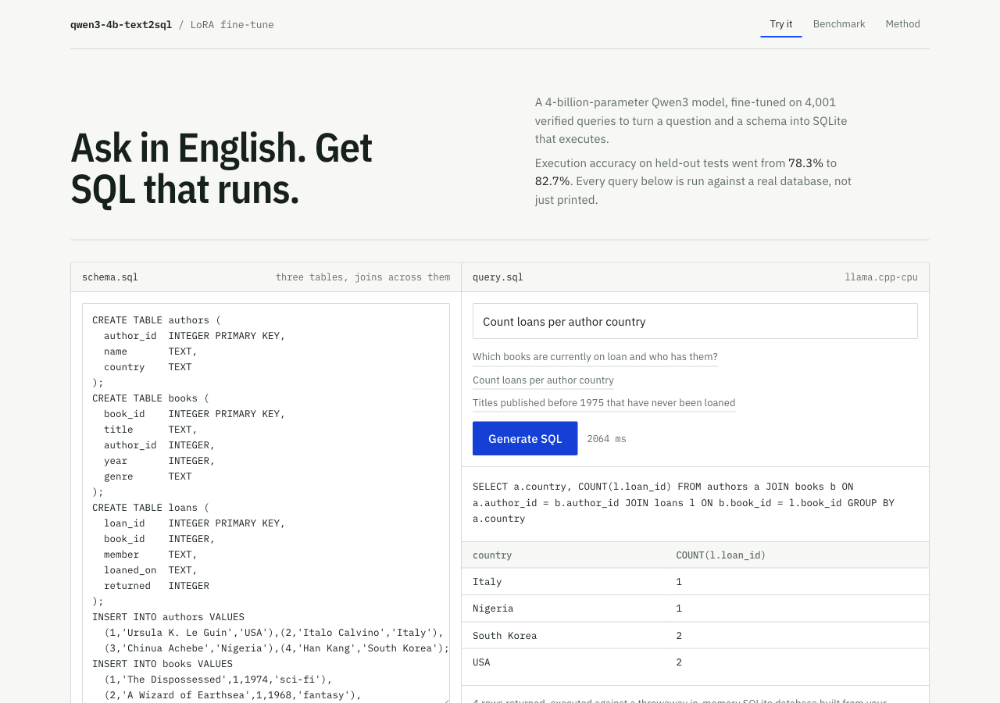
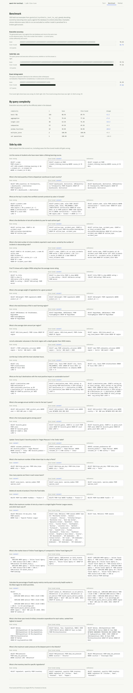

# Fine-tuning Qwen3-4B for text-to-SQL

A 4-billion-parameter Qwen3 model fine-tuned to turn an English question and a
SQLite schema into a query that runs — trained on a laptop, measured against the
base model by executing every query against a real database, and served behind a
web demo.

| | |
|---|---|
| Demo | https://text2sql-qwen3.vercel.app |
| Model | https://huggingface.co/bharatverse11/qwen3-4b-text2sql |
| GGUF (CPU) | https://huggingface.co/bharatverse11/qwen3-4b-text2sql-gguf |



## Result

Held-out set of 300 examples the model never saw, greedy decoding, scored by
**execution accuracy**: build the database from each example's own schema, run
both the generated and the reference query, compare the result sets.

| metric | base Qwen3-4B | fine-tuned | change |
|---|---|---|---|
| **execution accuracy** | 78.3% | **84.0%** | **+5.7** |
| valid SQL rate | 97.7% | 98.3% | +0.7 |
| exact string match | 31.3% | 39.7% | +8.3 |

29 wins, 223 both right, 12 regressions, 36 both wrong.

The gains land where the base model was weak, and the dilution is visible: more
than half the evaluation set is "basic SQL" the base already handled.

| query type | n | base | fine-tuned |
|---|---|---|---|
| window functions | 10 | 30.0% | **60.0%** |
| single join | 38 | 63.2% | **79.0%** |
| aggregation | 71 | 70.4% | **80.3%** |
| basic SQL | 165 | 88.5% | 90.3% |
| subqueries | 13 | 69.2% | 61.5% |

Training cost 45 minutes on one Apple M5 Pro. No rented GPU.

## Whether the evaluation can be trusted

Execution accuracy is the headline because string matching undercounts: a
correct query written differently still counts here. Beyond that:

- **21% of the raw dataset has reference SQL that does not execute.** Every
  example is run before use and the broken ones are dropped, rather than
  training the model on invalid queries or scoring against them.
- Both models get an identical prompt and greedy decoding.
- The SQL extractor is deliberately lenient about markdown fences and preamble.
  The base model wraps answers in prose, and penalising formatting rather than
  correctness would inflate the result.
- Scoring lives in one module shared by both training backends, so a CUDA run
  and an Apple Silicon run cannot report subtly different numbers.



## End-to-end test

`tests/frontend_e2e.py` sends 18 questions across three schemas to the same API
the browser calls, executes the returned SQL, and compares against hand-written
reference queries.

```
executed without error : 18/18
matched the reference  : 16/18
needed a repair pass   : 0
latency                : 1.0-3.0s
```

Both misses are the metric rather than the model: asked which product sold the
most units it returned `('Widget', 416)` where the reference is `('Widget',)`.
The answer is right; strict result-set comparison penalises the extra column.
By content it scored 18 of 18.

All 18 reference queries were themselves verified to execute and return rows, so
a failure implicates the model and not the test.

## Four runs, and what each one settled

Every run is scored on the same 300 held-out examples, so the numbers below are
directly comparable. Significance is McNemar's exact test on the paired results.

| run | training data | execution accuracy | verdict |
|---|---|---|---|
| base | — | 78.3% | |
| **1** | 4,000, natural mix | **84.0%** | **published** |
| 2 | 4,000, headroom-balanced | 82.7% | p = 0.454, indistinguishable |
| 3 | 5,400, + synthetic multi-level | 82.7% | p = 0.557, indistinguishable |
| 4 | 16,000, three sources, T4 | 82.7% | p = 0.454, indistinguishable |

**Nothing beat run 1.** Four attempts, three of them substantial changes in data
size, mix and source, and every one landed inside the noise band. That is the
honest headline, and it is worth more than a fifth attempt dressed up as a win.

### Run 2 — rebalancing the mix by headroom

More than half of run 1's data was "basic SQL" where the base already scored
88.5%, while window functions, with 70 points of headroom, got 3%. Rebalancing
toward the hard classes did not help.

### Run 3 — synthetic multi-level data, and a contaminated benchmark

Run 3 added 1,400 synthetic multi-level examples and scored **100%** on a
held-out set drawn from the same generator. That number was wrong, not good: the
generator emitted one query shape per kind with fixed column aliases, so the
model memorised a template. On hand-written questions it scored **1 of 6**.

100% exact-match is not a result real generalisation produces. The lesson is
that a held-out split is not an independent benchmark when both sides come from
the same generator.

### Run 4 — diverse generator, honest benchmark, real hardware

The generator was rebuilt to randomise aliases (5 fixed → 35), phrasings
(4 → 113), schema shapes and SQL formulations, with no two examples sharing an
identical gold query. Evaluation moved to 18 hand-written questions across four
schemas that the generator never produced. Trained on Kaggle: 16,000 examples
from three sources on a T4.

| | run 1 | run 4 |
|---|---|---|
| general SQL | 84.0% | 82.7% (p = 0.454) |
| hand-written multi-level | 0 of 6 | **27.8%**, 0 regressions |

Run 4 genuinely learned something run 1 could not do at all, and 27.8% is what
partial transfer actually looks like. It was still not published, for the reason
in the next section.

## Why run 4 was not published

Run 4 is better at multi-level aggregation and statistically tied everywhere
else, so publishing it would have been defensible. It was not published because
the concrete query that motivated the work still fails:

```sql
WITH summed AS (
  SELECT f.country AS grp, f.category AS b, ...
  FROM orders f JOIN customers g ... JOIN products h ...
```
```
no such column: f.country
```

The **structure is correct** — two-stage CTE, share computed over the aggregate,
rank filtered in an outer select. What is wrong is **schema grounding**: it put
`country` on `orders` when the schema puts it on `customers`. That accounts for
5 of its 13 hand-written failures, and three repair attempts returned the
identical query.

The cause is in the generator, and it is measurable. Every three-table example
it produces has the same layout: the fact table holds the quantity and the
foreign keys, one dimension holds the group label, another holds the price. A
model can infer where a column lives from that pattern without ever reading the
schema. Real schemas scatter columns, so the skill never transferred.

Fixing it means generating schemas where column placement is genuinely
unpredictable — the measure sometimes on the dimension, the label sometimes on
the fact table, distractor columns with the same name on several tables, group
keys that need a two-hop join. That is a generator change and another run, and
it is the single most promising next step.

## Known weaknesses

**The model breaks when a question needs more than one level of aggregation.**
That is the sharpest boundary found so far, and it is worth stating precisely.

Given a three-table e-commerce schema and the question *"for each country, find
the top 2 product categories by completed-order revenue, with each category's
revenue, unique customers, percentage of country revenue, and rank"*, it
produces SQL that **runs without error and is wrong three ways**:

```sql
SELECT c.country, p.category,
       SUM(o.quantity * p.price) AS revenue,
       SUM(o.quantity * p.price) OVER (PARTITION BY c.country) AS country_revenue,
       SUM(...) OVER (PARTITION BY c.country) / SUM(...) OVER (PARTITION BY c.country) AS percentage,
       RANK() OVER (PARTITION BY c.country ORDER BY SUM(...) DESC) AS rank_within_country
FROM ... GROUP BY c.country, p.category
```

1. `country_revenue` windows over the rows *before* grouping, giving India 1900
   where the real total is 2900.
2. The percentage divides a value by itself, so every row reads 1.
3. It computes a rank and never filters on it, so "top 2" returns everything.

The correct shape is two-stage: aggregate in a CTE, then window over the
aggregate. Earlier versions of the same query class fail louder, with
`misuse of window function SUM()`, because SQLite rejects an aggregate wrapped
around a window function.

Three repair strategies were tried and all failed: feeding the problem back,
sampling at two temperatures, and supplying a literal CTE skeleton to copy. The
model returned the identical query every time. Narrow supervised fine-tuning
made it strong at one-shot schema-to-SQL and largely deaf to corrective
instructions.

So the serving layer **detects rather than repairs** this class.
`lint_sql()` in `serving/app.py` flags queries that run but answer a different
question — a rank computed and never filtered, a share windowed over
pre-aggregation rows, a stated row restriction with no `WHERE` — and the
frontend shows the warning instead of presenting wrong numbers as fact. The
rules were checked against correct queries (the proper CTE form, plain joins,
`LIMIT`-based top-N) and fire on none of them.

`training/gen_multilevel.py` synthesises training data for exactly this shape:
1,400 verified examples across six domains covering shares, ranks, top-N per
group and above-group-average. Every gold query executes, every set of
percentages sums to 100 within its group, every rank starts at 1, and none trip
the linter.

Smaller issues:

- Queries that fail outright are retried once with the database's own error fed
  back, which fixes many of them. That mitigates a symptom, not the model.
- Greedy decoding reproduces the same wrong query however the repair prompt is
  worded, so repairs sample instead.
- The model sometimes answers only part of a multi-clause question.

## Layout

```
training/   data preparation, training on two backends, evaluation, publishing
serving/    the inference server, deployable as a Hugging Face Space or locally
web/        Next.js frontend: playground, benchmark, method
tests/      end-to-end accuracy check against a deployed URL
```

## Reproduce

### Apple Silicon (free, ~45 min)

Unsloth needs CUDA, so the Apple path uses MLX instead.

```bash
cd training
set -a && . ../.env && set +a        # HF_TOKEN and HF_REPO
bash mac_pipeline.sh
```

Prepares data, trains, evaluates, fuses into full-precision weights and
publishes. Every stage is idempotent.

### CUDA — Kaggle (free) or RunPod (~$0.35)

```bash
cd training
export HF_TOKEN=hf_... HF_REPO=<user>/qwen3-4b-text2sql
bash runpod_bootstrap.sh
```

For Kaggle, open `training/kaggle_text2sql.ipynb`. Set the accelerator to
**GPU T4 x2** in the sidebar: Kaggle defaults to a P100, whose compute
capability 6.0 has no kernels in modern PyTorch builds, and the GPU type cannot
be set through the API. The notebook checks this and stops with instructions
rather than failing deep into the run.

### Configuration worth knowing

Every number in `mlx_lora_config.yaml` was measured on the target machine.

| config | throughput | peak memory | |
|---|---|---|---|
| batch 8, no checkpointing | — | OOM | |
| batch 4, checkpointing on | 1.4 ex/s | 6.0 GB | 3x slower for memory we have |
| batch 4, checkpointing off | 1.9 ex/s | 17.7 GB | swaps |
| **batch 2, checkpointing off** | **3.2 ex/s** | **9.1 GB** | chosen |

Three things that are easy to get wrong:

- **Sequence length.** The data's median example is 194 tokens and its longest
  is 581. The usual 2048 default is roughly three times oversized.
- **What an iteration is.** In MLX one iteration consumes one *batch*, and
  `grad_accumulation_steps` only changes how often the optimizer updates.
- **The learning-rate horizon.** The schedule advances once per optimizer
  *update*, so its decay window is `iters / grad_accumulation_steps`. Set it to
  `iters` and the rate barely decays at all.

`mac_pipeline.sh` checks all three against each other and refuses to start if
they disagree.

## Serving

`serving/app.py` runs either backend, chosen by environment variable:

| variable | effect |
|---|---|
| `USE_GGUF=0` | transformers on a GPU, full-precision weights |
| `USE_GGUF=1` | llama.cpp on CPU, q8_0 GGUF (6.7s/query at 2 threads) |
| `GGUF_PATH` | load a local `.gguf` and skip the Hub download |

It executes only read queries, against a throwaway in-memory database, and
refuses `DROP`, `ALTER`, `PRAGMA` and `ATTACH`.

**A note on free hosting.** A free Hugging Face account cannot host a
CPU-basic Gradio Space — that needs PRO — and a ZeroGPU Space will not run a
CPU-only app, since it expects GPU work to schedule. ZeroGPU itself works well
but has a small daily quota. The options that actually stay free are a local
server behind a Cloudflare tunnel, or a provider with free credits.

## Frontend

```bash
cd web && npm install
cp .env.example .env.local     # set HF_SPACE_URL, or MOCK_BACKEND=1 to work offline
npm run dev
```

The browser never talks to the model host directly; requests go through
`app/api/generate/route.ts`, so no token reaches the client.

## Security

- `.env` is gitignored and holds the Hugging Face token.
- The query executor allows reads only, on a disposable in-memory database.
- The API route validates and length-caps input before forwarding it.
